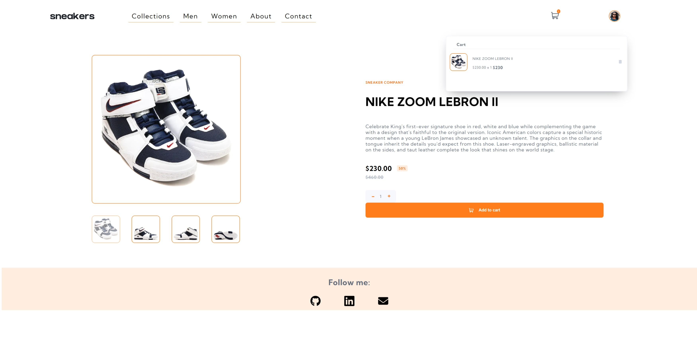

# Frontend Mentor - E-commerce product page solution

This is an e-commerce page solution with many functionalities. 

## Table of contents

- [Frontend Mentor - E-commerce product page solution](#frontend-mentor---e-commerce-product-page-solution)
  - [Table of contents](#table-of-contents)
  - [Overview](#overview)
    - [The challenge](#the-challenge)
    - [Screenshot](#screenshot)
    - [Links](#links)
  - [My process](#my-process)
    - [Built with](#built-with)
    - [What I learned](#what-i-learned)

## Overview

### The challenge

Users should be able to:

- View the optimal layout for the site depending on their device's screen size
- Navigate through the multiple pages of the website
- See hover states for all interactive elements on the page
- Switch the large product image by clicking on the small thumbnail images
- Add items to the cart
- View the cart and remove items from it

### Screenshot

### Links

- Solution URL: [[Add solution URL here](https://github.com/edukaki/e-commerce-product-page)]
- Live Site URL: [[Add live site URL here](https://e-commerce-product-page-kohl.vercel.app/)]

## My process

### Built with

- Semantic HTML5 markup
- CSS custom properties
- Flexbox
- Desktop-first workflow
- [React](https://reactjs.org/) - JS library

### What I learned

- With this project I learned how to develop multiple pages with react-router-dom and params. It was a great challenge!